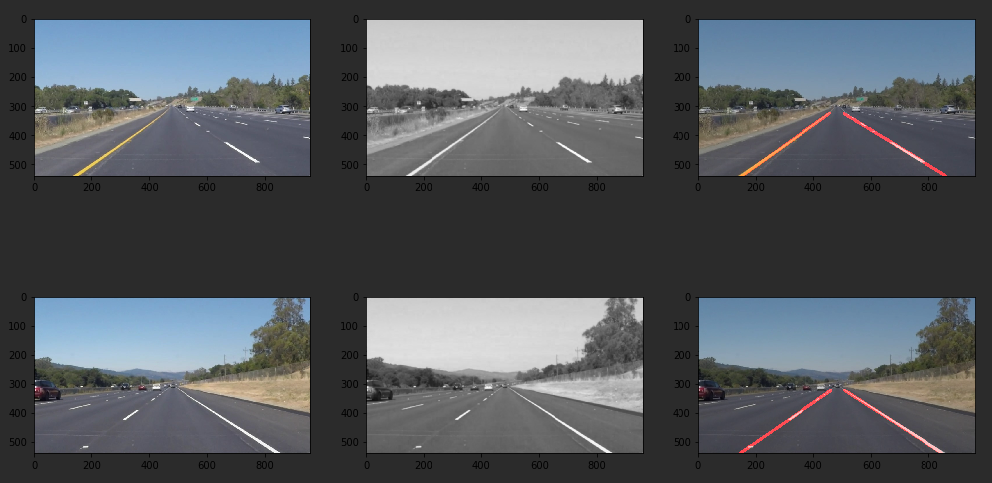

**Finding Lane Lines on the Road** 
---

### - My pipeline:

#### 1.  Pre-process the input image:

First, I converted the images to gray scale using a filter with yellow mask to get better line contrast, then I reduce the noise in the image by applying gaussian blur algorithm 

#### 2. Find edges in the processed image:
Before to be able to detect lane lines is important to find edges in the image, to achieve this I used the canny transformation algorithm.

#### 3. Select the region of interest and eliminate anything else
for a better lane lines detection we only consider the edges inside a four-side polygon that specify where the lane lines are suppose to be.
I use the dimension of the image to calculate the vertices of polygon.

I block out all the edges that outside the polygon using the function fillPoly of OpenCV library.

#### 4. Get lines from the edges:
To get lines from the edges I use the Hough transformation algorithm, these lines are the key to identify the lane lines.

#### 5. Identify the lane lines: 
In order to draw a single line on the left and right lanes, I modified the draw_lines() function by 
first grouping the lines using the angle (negative for left and positive for right), then I average the slope and intercept of each lines to get the equation of the line: y = mx + b,
I calculate the initial y final points for the final lane line using the equation

#### 6. Overlay the original image with the final lines
At the end of the pipeline I return the overlap image that combine the original with the final lines.

## Test images

## Potential shortcomings with my pipeline
One potential shortcoming would be the case when the lines on the road have minimal difference because the canny transform can't detect edges  

Another shortcoming could be if there is a car close enough of the camera (inside the region of interest) in these case the draw lines function will mess up the average of each lane line.

### Possible improvements to my pipeline

A possible improvement would be to apply better color filters at the input image in order to get better edges detection.

Another potential improvement could be to tweak the parameters for better performance.
